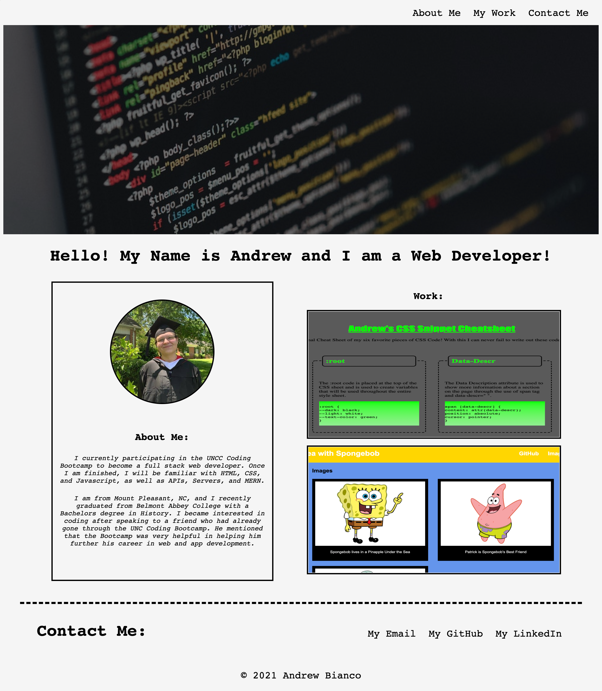

# My First Portfolio

## Table of Contents

- Description
- Usage
- Credits

[Description](#Description)

My project was to create my own portfolio from scratch. On my portfolio, you will see a hero image and navigation links to the contents on my page.

Below the hero image, you will see a sidebar on the left with my profile picture and a short bio about myself. On the right, you will see two boxes with pictures of my current live applications.

Below these, you will find my footer with my contact links and copyright tag.

[Usage](#Usage)

In the header are three navigation links. When you hover over these, the links will change from black to green and will appear with an underline. When you click on the navigation links, the UI scrolls to the corresponding sections on the application.

In the work section, there are two boxes. When you hover over the boxes, the image will darken and a green box shadow will appear around the images.

In the footer are three more links. These links will also turn green and become underlined when you hover over them. When these links are clicked on, they will open a new tab and take you to the corresponding site.

Here is a link to the deployed site: https://morrisbianco.github.io/my-first-portfolio/

EDIT #1: 

After the first project, I have updated my portfolio with a new framework and with my project now included in the work section. 

[Credits](#Credits)

I was inspired for this design by Kathryn McClintock's portfolio as found on https://www.freecodecamp.org/news/15-web-developer-portfolios-to-inspire-you-137fb1743cae/